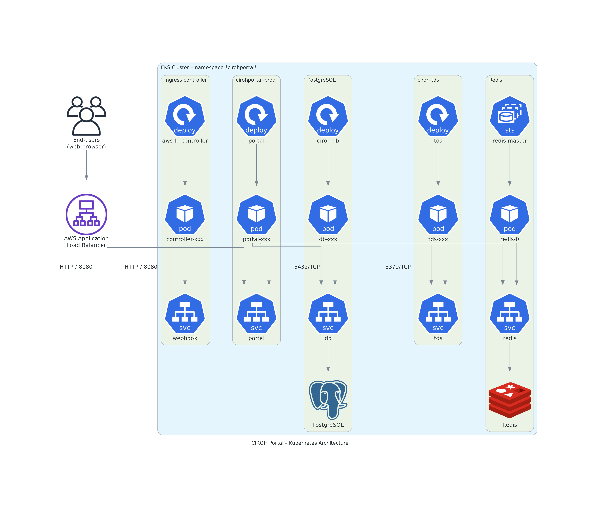

<p align="center">
  
</p>

<h1 align="center">💧 CIROH Tethys Portal</h1>



> The **CIROH Portal** runs on an Amazon EKS cluster (`namespace: cirohportal`) and routes traffic like so:

* 🌍 **Users** → **AWS Application Load Balancer** (managed by the *AWS Load Balancer Controller*).
* 📦 The ALB forwards HTTP :`8080` to:
  * 🖥️ `portal` Service → CIROH web app.
  * 📈 `tds` Service → THREDDS Data Server for large-file downloads.

Inside the namespace:

| Layer | Kubernetes Object | Purpose |
|-------|-------------------|---------|
| 🖥️ **CIROH Portal** | Deployment → Pod(s) | Django/Tethys web stack |
| 📈 **THREDDS** | Deployment → Pod | Catalog + OPeNDAP downloads |
| 🐘 **PostgreSQL** | Deployment → Service :`5432` | User data & configuration |
| ⚡ **Redis** | StatefulSet → Service :`6379` | Session & cache data |

Arrows in the diagram emphasise that **portal Pods talk to PostgreSQL (durable) and Redis (ephemeral)**, while **only the ALB is Internet-facing**—keeping private services private and cleanly separating compute, storage, and caching. 🔒✨

---

## 📚 Built-in Apps

| # | App | Kind |
|---|-----|------|
| 1 | [Tethys Dash](https://github.com/tethysplatform/tethysapp-tethys_dash) | 🌊 Native |
| 2 | [Water Data Explorer](https://github.com/BYU-Hydroinformatics/Water-Data-Explorer) | 🌊 Native |
| 3 | [HydroCompute + HydroLang Demo](https://github.com/tethysplatform/tethysapp-hydrocompute) | 🌊 Native |
| 4 | [SWEML](https://github.com/karnesh/tethysapp-sweml) | 🌊 Native |
| 5 | [Ground Subsetting Tool](https://github.com/Aquaveo/ggst) | 🌊 Native |
| 6 | [Snow Inspector](https://github.com/BYU-Hydroinformatics/snow-inspector) | 🌊 Native |
| 7 | [CSES](https://github.com/whitelightning450/Tethys-CSES) | 🌊 Native |
| 8 | [NWM Map Viewer](https://water.noaa.gov/map) | 🌐 Proxy |
| 9 | [CIROH JupyterHub](https://jupyterhub.cuahsi.org/hub/login) | 🌐 Proxy |
| 10 | [HydroShare](https://www.hydroshare.org/home/) | 🌐 Proxy |
| 11 | [FIM Visualization](https://hydroinformatics.uiowa.edu/lab/fims/) | 🌐 Proxy |
| 12 | [Numerical Flash-Flood Alerts](https://numericalflashfloodalertsolutions.com/) | 🌐 Proxy |

---

## 🚀 Installation (on AWS)

> **Terraform + EKS = easy reproducible infra** 🪄

### 1 · Prerequisites 🛠️

* 🖥️ [AWS CLI](https://docs.aws.amazon.com/cli/latest/userguide/getting-started-install.html)
* 🔑 AWS credentials / named profile  
  (`~/.aws/credentials`)
* 🌍 [Terraform](https://developer.hashicorp.com/terraform/tutorials/aws-get-started/install-cli)

### 2 · Terraform Modules Structure 📂

```bash
terraform/
├── modules
│   └── ciroh_portal
│       ├── alb.tf
│       ├── efs.tf
│       ├── eks.tf
│       ├── iam-policy.json
│       ├── karpenter.tf
│       ├── main.tf
│       ├── metrics_server.tf
│       ├── networking.tf
│       ├── outputs.tf
│       ├── scripts
│       ├── tethys_portal.tf
│       └── variables.tf
├── prod
│   ├── backend.tf
│   └── main.tf
└── README.md
```
Module variables you may tweak (region, cluster name, Helm chart …)

**For example:**

```hcl
source = "../modules/ciroh_portal"
# Input Varibles
region              = "us-east-1"
profile             = "456531024327"
cluster_name        = "ciroh-portal-prod"
app_name            = "cirohportal"
helm_chart          = "ciroh"
helm_repo           = "https://docs.ciroh.org/tethysportal-ciroh"
helm_ci_path        = "../../charts/ciroh/ci"
environment         = "prod"
single_nat_gate_way = false
use_elastic_ips     = true
eips                = ["...", "..."]
```

### 3 · Deploy 📦

In order to deploy the following commands can needs to be run:

**Configure kubectl**

```bash
# 1️⃣ Configure kubectl
aws eks update-kubeconfig \
  --name <cluster_name> --region <region> --profile <profile>

# 2️⃣ Terraform workflow
terraform init
terraform plan      # review 🤓
terraform apply     # 🚀

# (dev only) clean-up afterwards
terraform destroy
```

If the environment is a development one: the following code needs to be run after the dev env has been tested: `terraform destroy`

>**__NOTE__**: When terrafrom is deployed. It deploys the tethys portal using the helm provider. You need to be careful to check the the paths `charts/ciroh/ci/prod_aws_values.yaml` and `charts/ciroh/ci/dev_aws_values.yaml` depending on the environment that you are deploying to. You might need to check that you are using the correct configuration (docker image, etc)

### 4 · Upgrade Deployment only 🔄 

Once the deployment is completed, it is not necessary to deploy the whole infrastructure every time there is a change. If there is an update in the image that the portal is using the following command can be used:

```bash
# add the helm repo
helm repo add tethysportal-ciroh https://docs.ciroh.org/tethysportal-ciroh

helm upgrade cirohportal-prod tethysportal-ciroh/ciroh \
  --install --wait --timeout 3600 \
  -f charts/ciroh/ci/prod_aws_values.yaml \
  --set storageClass.parameters.fileSystemId=<EFS_ID> \
  --set image.tag=<newTag> \
  --namespace cirohportal
```


>**❗ Remember:** You need to use the `--set storageClass.parameters.fileSystemId` to upgrade because it was not referenced when the chart was deployed with the terraform scripts. Therefore, you need to do it manually also for the upgrade. Similarly, in the values.yaml that you use you need to have `enabled: true` in the **StorageClass** section or it will produce an error.

If you upgrade fails with the following error:

```bash
Error: UPGRADE FAILED: another operation (install/upgrade/rollback) is in progress
```

you can rollback to a previous revision with:

```bash
helm history <release> --namespace <namespace>
helm rollback <release> <number_release> --namespace <namespace>
```

More on this in the following [medium article](https://medium.com/nerd-for-tech/kubernetes-helm-error-upgrade-failed-another-operation-install-upgrade-rollback-is-in-progress-52ea2c6fcda9)

### 5 · Troubleshooting 🐞

- When the `terraform destroy` command does not work in one run, it can be du to a couple of reasons:
  - The ALB ingress gets destroy before, so the ingresses of the Tethys portal do nto get deleted. You might need to delete them in the AWS dashboard --> EC2--> Load Balancers
  - The VPC cannot be deleted, This is also realted to the ALB ingress being deleted before (leaving the ingresses of the Tethys Portal hanging around after the creation) As a result, the VPC is still being used by these Load Balancers. Delete the Load Balancers, and then the VPC in the AWS dashboard
- Deleting manually can sometimes cause the following error:
  - `Kubernetes cluster unreachable: invalid configuration: no configuration has been provided, try setting KUBERNETES_MASTER environment variable`
  - The following [Github Issue Comment](https://github.com/terraform-aws-modules/terraform-aws-eks/issues/1234#issuecomment-894998800) is helpful
  - The following [Medium Article](https://itnext.io/terraform-dont-use-kubernetes-provider-with-your-cluster-resource-d8ec5319d14a) is helpful as well

### 6 · Handy Tools 🔧

Monitoring cluster and deployments: [k9s](https://k9scli.io/)
Visualizing dynamic node usage within a cluster: [eks-node-viewer](https://github.com/awslabs/eks-node-viewer)

### 7 · Submodule Dev ✨

When updating git submodules the following can be useful: https://stackoverflow.com/questions/29882960/changing-an-existing-submodules-branch
